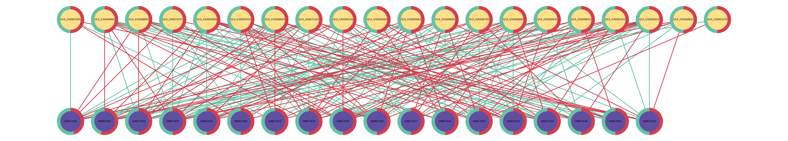

# netbalance

**netbalance** is a Python library and CLI tool for balancing and visualizing multi-cluster interaction (association) networks.


## Installation

```bash
pip install netbalance
```

## Quick start

Balancing an interaction network using **entity-balanced sampling**:

```bash
cat data/virus-host.csv | netbalance --seed 0 --max-iter 1000
```

Balancing an interaction network using **uniform random sampling** with a 1:1 negative-to-positive ratio:

```bash
cat data/virus-host.csv | netbalance -m balanced --negative-ratio 1.0
```

Visualizing a bipartite network:

```bash
cat data/virus-host.csv | netbalance viz -o virus-host.png
```

## Data format

All inputs are CSVs where the first N columns are entity names (one per cluster) and the last column is a binary label (`1` = positive interaction, `0` = negative):

```
A,B,interaction
A1,B2,1
A1,B4,0
```

The `viz` subcommand requires exactly 2 entity columns (bipartite).

## Python API

If you prefer to use the Python API instead of the CLI, see the [example notebook](example.ipynb).

## Example usage

### Balancing and visualizing a virus-host interaction network

The following cammand uses the entity-balanced sampling method to balance a virus-host interaction network, then visualizes the balanced network as a bipartite graph.

```bash
cat data/virus-host.csv | netbalance --seed 0 --max-iter 20000 --delta 0.001| netbalance viz -o virus-host.png
```

The resulting graph is shown below:



### Entity-balanced sampling without the degree-ratio guided intialization

```bash
cat data/virus-host.csv | netbalance --seed 0 --max-iter 20000 --delta 0.001 --no-heuristic
```

### netbalance in Snakemake

This is an example Snakemake workflow that runs netbalance on a virus-host interaction network with 4 different random seeds, producing 4 balanced datasets.

```python
rule all:
    input:
        expand("virus-host-entity-balanced-seed-{seed}.csv", seed=range(1, 5))


rule netbalance:
    input:
        "virus-host.csv"
    output:
        "virus-host-entity-balanced-seed-{seed}.csv"
    shell:
        """
        netbalance {input} \
            -o {output} \
            --seed {wildcards.seed} \
            --max-iter 1000 \
            --delta 0.01
        """
```
